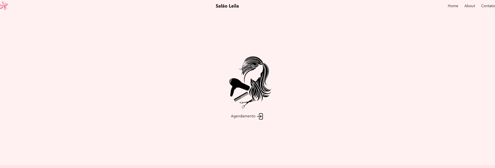

# Sistema de Agendamento

Este é um sistema de agendamento completo, desenvolvido para simplificar a gestão de horários e serviços em salões de beleza. Utilizando tecnologias modernas como Docker, PostgreSQL, Prisma, Express, TypeScript e React.js, o sistema oferece uma experiência de agendamento eficiente e intuitiva.

## Funcionalidades

- **Criar Agendamento**: Os usuários podem agendar um novo serviço, especificando o cliente, o serviço desejado e a data desejada.
- **Modificar Agendamento**: Permite aos usuários alterar a data de um agendamento existente com base no seu ID, oferecendo flexibilidade e facilidade de gerenciamento.
- **Obter Histórico de Agendamentos**: Os usuários têm acesso ao histórico completo de todos os agendamentos realizados, facilitando a consulta de informações passadas e o acompanhamento do histórico de clientes.

  []

## Tecnologias Utilizadas

- Back-end:

  - Docker
  - PostgreSQL
  - Prisma
  - Express.js
  - TypeScript

- Front-end:
  - React.js

# Rotas da API

## POST /agendamentos

Cria um novo agendamento.

### Parâmetros da Requisição

- `cliente` (string): Nome do cliente.
- `servico` (string): Serviço a ser agendado.
- `dataAgendamento` (string): Data do agendamento no formato "YYYY-MM-DD".

### Exemplo de Requisição

```json
{
  "cliente": "Fulano",
  "servico": "Corte de Cabelo",
  "dataAgendamento": "2024-03-15"
}
```

## PUT /agendamentos/:id

Modifica a data de um agendamento existente.

### Parâmetros da Requisição

- `id` (string): ID do agendamento a ser modificado.
- `dataAgendamento` (string): Nova data do agendamento no formato "YYYY-MM-DD".

### Exemplo de Requisição

```json
{
  "dataAgendamento": "2024-03-20"
}
```

## GET /agendamentos/historico

Retorna o histórico de todos os agendamentos.

### Exemplo de Resposta

```json
[
  {
    "id": 1,
    "cliente": "Fulano",
    "servico": "Corte de Cabelo",
    "dataAgendamento": "2024-03-15"
  },
  {
    "id": 2,
    "cliente": "Beltrano",
    "servico": "Manicure",
    "dataAgendamento": "2024-03-20"
  },
  {
    "id": 3,
    "cliente": "Ciclano",
    "servico": "Pedicure",
    "dataAgendamento": "2024-03-07"
  }
]
```

## Como utilizar

1 - Clone para o projeto

```
git clone https://github.com/rjunio98/salon
```

## Como rodar o frontend

1 - Acessar a pasta

```
cd frontend
```

2 - Instalar as dependências

```
npm install
```

3 - Executar o aplicativo

```
npm run dev
```

## Como rodar o backend

1 - Acessar a pasta

```
cd backend
```

2 - Instalar as dependências

```
npm install
```

3 - Executar o domando pra iniciar o container do Docker

```
docker-compose -up
```

4 - Executar o aplicativo

```
npm run dev
```
